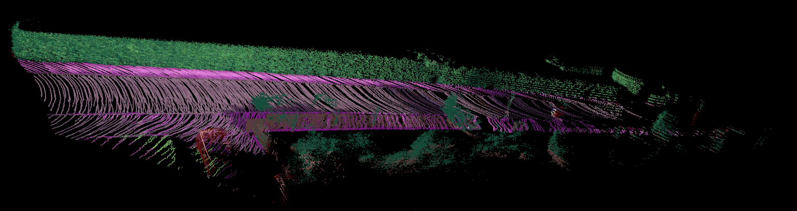
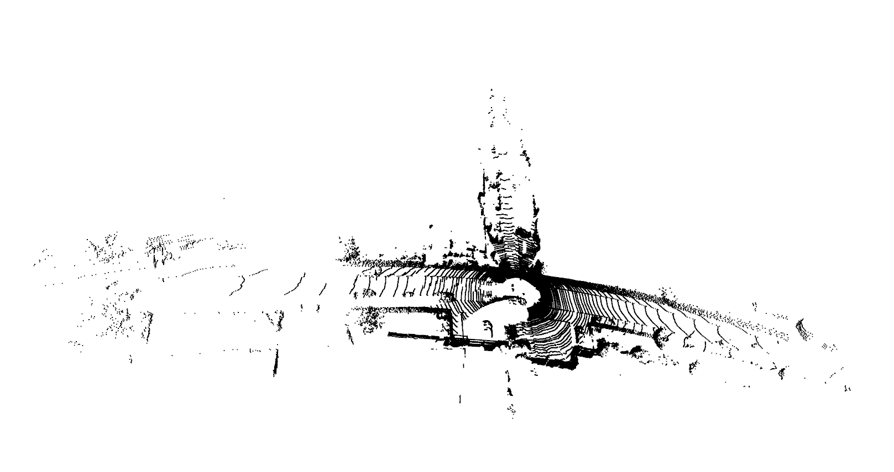
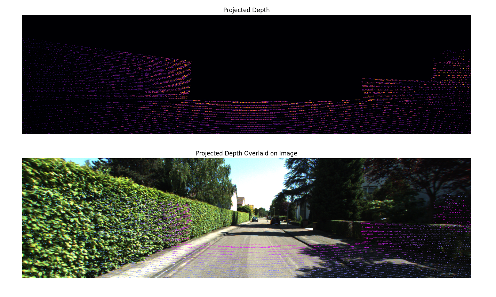
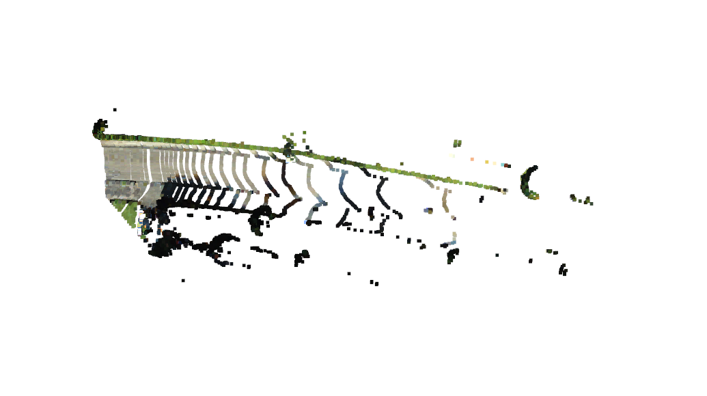
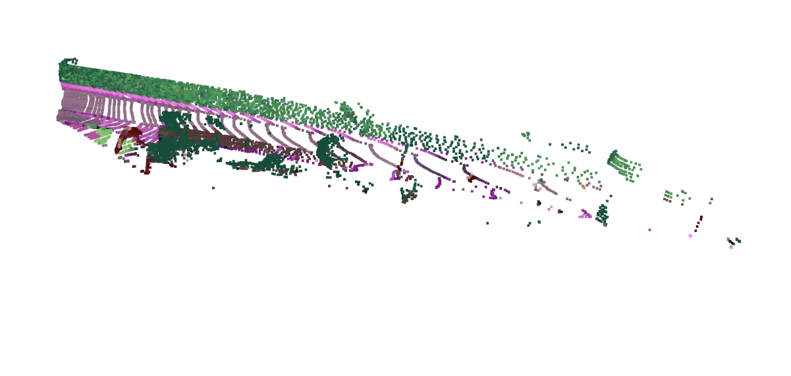
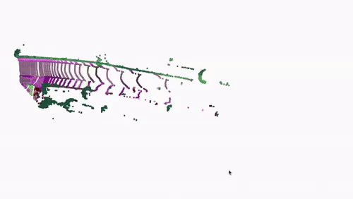

# Pointcloud-Segmentation



## Overview
In this project, I used [Kitti360](https://www.cvlibs.net/datasets/kitti-360/demo.php) dataset to give pointcloud semantic labels using segmentation obtained from a camera image of the scene. I used an implementation of segformer to generate semantic labels on the image. After applying semantic labels on multiple pointclouds, I used ICP registration to generate the mapping of the complete scene.

This repository does the following tasks.
1. Intrinsic calibration of perspective camera (Point Gray Flea 2).
2. Extrinsic calibration of the perspective camera with a Velodyne Lidar (HDL-64E).
3. Projecting lidar points on to the image plane (run ```python src/utils.py```).
4. Generating a colored pointcloud (run ```python src/gen_color_pcd.py```).
5. Applying semantic labels on the pointcloud and registering multiple pointclouds using ICP based registration(run ```python src/pointcloud_segmentation.py```).

## Dependencies
Refer to [this page](https://github.com/open-mmlab/mmsegmentation/blob/main/docs/en/get_started.md#installation) to install openMMlab's segmentation repository. Download and paste the desired model in the config folder. Change the ```segment_image.py``` file accordingly. Install OpenCV on python.

## Run instructions
1. To run the complete pipeline with segmentation and ICP registration:
``` 
python src/pointcloud_segmentation.py 
```
2. To generate colored pointcloud:
```
python src/gen_color_pcd.py 
```
3. To project lidar points onto the image:
```
python src/utils.py 
```
## Results


*Figure 1: Original Pointcloud*


*Figure 2: Poincloud Projection on Image Plane*


*Figure 3: Colored Pointcloud*


*Figure 4: Segmented Pointcloud*

<!--  -->


*Figure 5: ICP Registration demo*
 